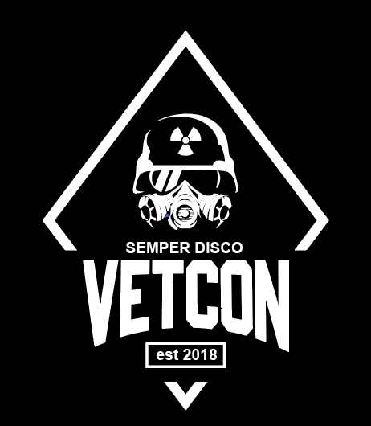
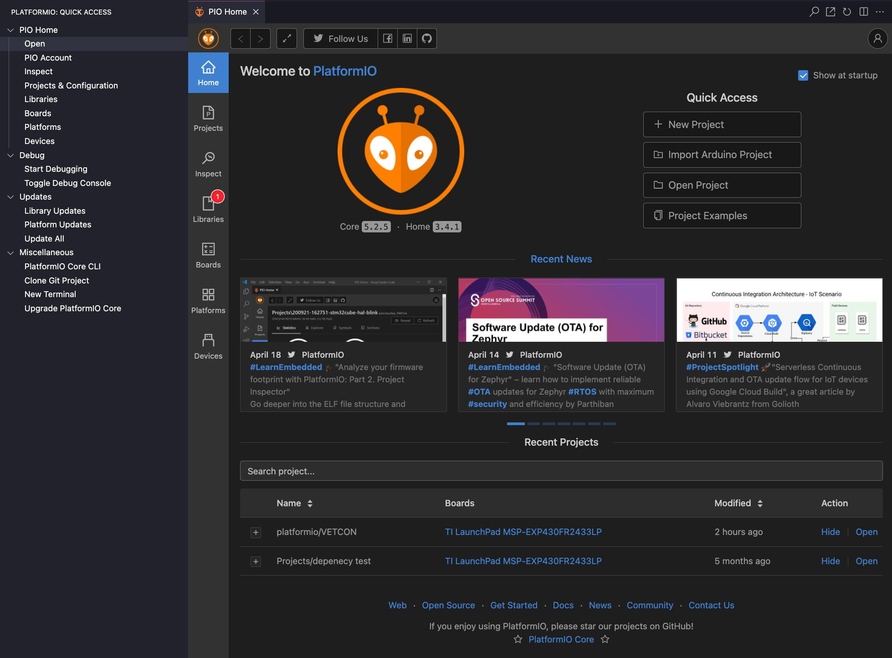
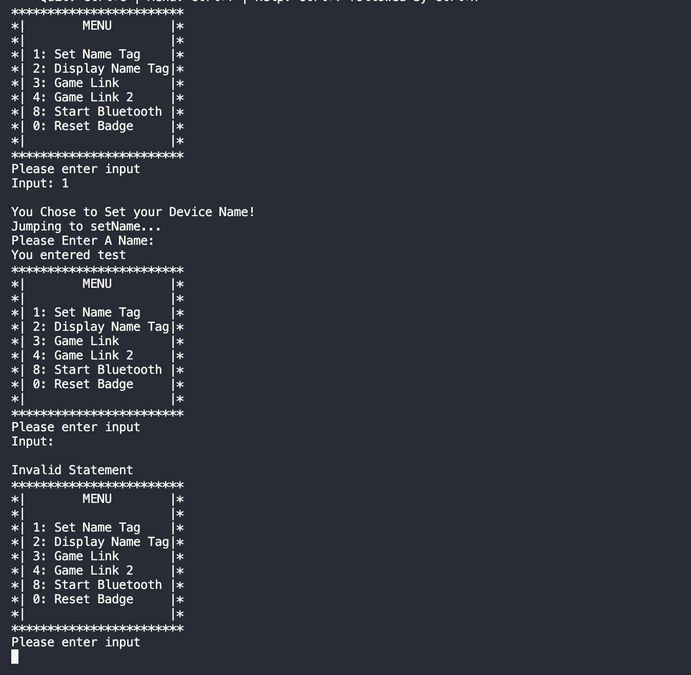
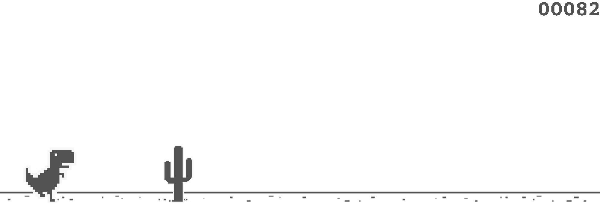
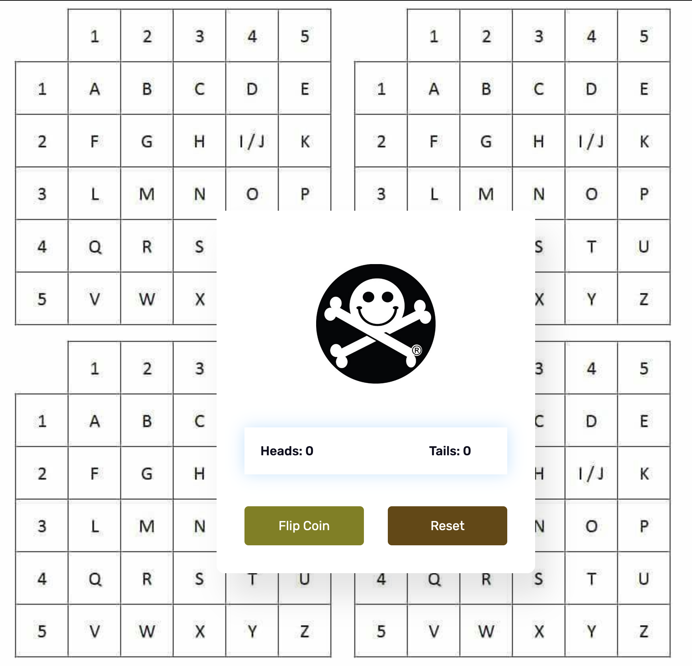
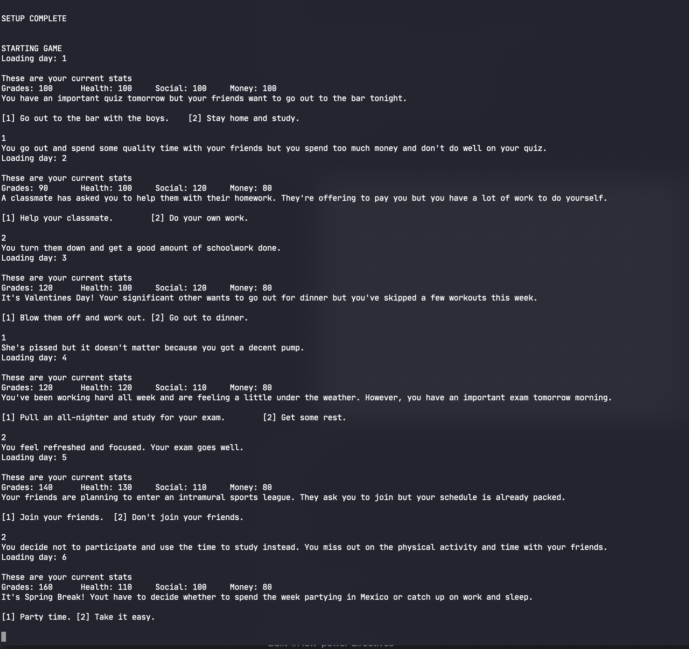

<div align="center">

  
  <h1> :skull: VETCON BADGE :skull: </h1>
  
  <p>
    TEAM 32 <span> · </span>2021-2022  
  </p>
  <p>
  SEMPER DISCO
  </p>
  
  
<!-- Badges -->
<p>
  <a href="https://github.com/derekbarbosa/EC463/graphs/contributors">
    
  </a>
  <a href="">
    
  </a>
  <a href="https://github.com/derekbarbosa/EC463/network/members">
    
  </a>
  <a href="https://github.com/derekbarbosa/EC463/issues">
    
  </a>
  <a href="https://github.com/derekbarbosa/EC463/blob/main/LICENSE">
    
  </a>
</p>

<h3>
  Quick Links!
</h3>
<h4>
    <a href="PLACEHOLDER">View Demo</a>
  <span> · </span>
    <a href="notes/README_Engineering.md">Quick Start Guide</a>
  <span> · </span>
    <a href="notes/README_HARDWARE.md">Hardware Guide</a>
  <span> · </span>
    <a href="notes/README_SOFTWARE.md">Software Guide</a>
</h4>

</div>

<br />

<!-- Table of Contents -->
# :notebook_with_decorative_cover: Table of Contents

- [:notebook_with_decorative_cover: Table of Contents](#notebook_with_decorative_cover-table-of-contents)
  - [:star2: About the Project](#star2-about-the-project)
    - [:label: Current Directory Structure](#label-current-directory-structure)
    - [:camera: Screenshots](#camera-screenshots)
    - [:space_invader: Tech Stack](#space_invader-tech-stack)
    - [:dart: Features](#dart-features)
      - [Embedded](#embedded)
      - [Minigames](#minigames)
  - [:toolbox: Getting Started](#toolbox-getting-started)
    - [:running: Quick(ly) Start!](#running-quickly-start)
  - [:eyes: Usage](#eyes-usage)
  - [:warning: License](#warning-license)
  - [:handshake: Contact](#handshake-contact)
  - [:gem: Acknowledgements](#gem-acknowledgements)

  

<!-- About the Project -->
## :star2: About the Project

### :label: Current Directory Structure
<a href="pcb/">pcb</a> – All PCB/eCAD files and schematics. Includes manufacturing .gbr files

<a href="enclosures/">enclosures</a> – All CAD files and schematics for the PCB enclosure. 

<a href="platformio/">platformio</a> – All code/firmware files concerning the MSP430 development board

<a href="notes/">notes</a> – Inital interview notes, MSP Documentation, useful infographics, additional READMEs

<a href="minigames/">minigames</a> – All code regarding Games 1, 2, and 3 (with CMake Files)

<a href="reports/">reports</a> – All previous reports for the 2021-2022 semester

<a href="derek/">derek</a> – Derek's personal folder for logbook maintenance

<a href="kircher/">kircher</a> – John's personal folder for logbook maintenance

<a href="etc/">etc</a> – Asset storage (logos, etc.)

<!-- Screenshots -->
### :camera: Screenshots

<div align="center"> 
  <p> PlatformIO VSCode Plugin "Home" Page </p>
  
</div>

<div align="center"> 
  <p> Sample Terminal Menu via Serial </p>
  
</div>

<div align="center"> 
  <p> Minigame #1 "Dino Run"</p>
  
</div>


<div align="center"> 
  <p> Minigame #2 "Coin Flip" </p>
  
</div>
<div align="center"> 
  <p> Minigame #3 "Text-based adventure" </p>
  
</div>

<!-- TechStack -->
### :space_invader: Tech Stack

<details>
  <summary>Embedded</summary>
  <ul>
    <li><a href="https://www.cplusplus.com/">C++</a></li>
    <li><a href="https://piolabs.com/company/about.html">PIOLabs</a></li>
    <li><a href="PlatformIO">PlatformIO</a></li>
    <li><a href="https://sourceforge.net/projects/mspgcc/">GCC Toolchain for MSP430 by TI</a></li>
    <li><a href="https://energia.nu/reference/">Energia Wiring-based Framework</a></li>
    <li><a href="https://registry.platformio.org/tools/platformio/tool-dslite">Uniflash Flash Tool for TI MCUs</a></li>
    <li><a href="http://wiring.org.co/">Wiring MCU Framework</a></li>
  </ul>
</details>

<details>
  <summary>Minigames</summary>
  <ul>
    <li><a href="https://phaser.io/">Phaser</a></li>
    <li><a href="https://webpack.js.org/">Webpack</a></li>
    <li><a href="https://www.typescriptlang.org/">Typescript</a></li>
    <li><a href="https://enable3d.io/">Enable3D</a></li>
    <li><a href="https://www.javascript.com/">Javascript</a></li>
    <li><a href="https://developer.mozilla.org/en-US/docs/Glossary/HTML5">HTML5</a></li>    
    <li><a href="https://cmake.org/">CMake</a></li>
  </ul>
</details>


<!-- Features -->
### :dart: Features

#### Embedded
- Interactive Shell/Terminal "UI"
- Customizeable
- Built-in LED Toggles
- Bluetooth Capable!
- Built-in low-power directives

#### Minigames
<details>
<summary> Game 1 </summary>
<ul>
<li> Interactive 'runner' game </li>
<li> Obfustication of source using Webpack and Babel for compilation</li>
<li> Hidden 'secrets' ;) </li>
</ul>
</details>
<details>
<summary> Game 2 </summary>
<ul>
<li> Interactive UI elements</li>
<li> Fluid animation using CSS! </li>
<li> Lightweight in-line JS </li>
<li> Built-in cookie storage and retrieval</li>
<li> Hidden 'secrets' ;) </li>
</ul>
</details>
<details>
<summary> Game 3</summary>
<ul>
<li> Interactive decision-based RPG-like text adventure </li>
<li> Open-ended Game Engine with Global Update features for future development and hackability </li>
<li> Text Engine incorporated at Compile-Time with simple .tsv formatting </li>
<li> Built-in undetectable "malware" with std::Threads </li>
<li> Hidden 'secrets' ;) </li>
</ul>
</details>


<!-- Getting Started -->
## 	:toolbox: Getting Started

<!-- Run Locally -->
### :running: Quick(ly) Start!

Clone the project

```bash
  git clone https://github.com/derekbarbosa/EC463.git
```

Then refer to the Quick Start Guide in its entirety! :)
[Quick Start Guide](notes/README_Engineering.md)


<!-- Usage -->
## :eyes: Usage

For a more detailed breakdown of the software components, how they work, how to implement them and how to expand on them, please refer to the [Software Guide](./notes/README_SOFTWARE.md)

For notes and explanation regarding hardware, building a functional breadboard prototype, understanding the modularity of several components, and PCB breakdown, please refer to the [Hardware Guide](./notes/README_HARDWARE.md)


<!-- License -->
## :warning: License

Distributed under the GNU GPL v3 LICENSE. See  <a href="https://www.github.com/derekbarbosa/EC463/blob/main/LICENSE">LICENSE.TXT</a> for more information.


<!-- Contact -->
## :handshake: Contact

<h4>Client</h4>

Mike Jones - jonesmlr (AT) gmail (dot) com

<h4> Team Members </h4>

<br> Derek Barbosa - dbarbosa (AT) bu (dot) edu </br>
<br> Ryan Sullivan - ryanbs (AT) bu (dot) edu </br>
<br> John Kircher - kircherj (AT) bu (dot) edu </br>
<br> Julian Padgett - jpadgett (AT) bu (dot) edu </br>
<br> Carlos Ortiz - cartex10 (AT) bu (dot) edu </br>

<br> Project Link: [https://github.com/derekbarbosa/EC463](https://github.com/derekbarbosa/EC463) </br>


<!-- Acknowledgments -->
## :gem: Acknowledgements

Some shout-outs, acknowledgements and resources!

 - [Shields.io](https://shields.io/)
 - [Awesome README](https://github.com/matiassingers/awesome-readme)
 - [Emoji Cheat Sheet](https://github.com/ikatyang/emoji-cheat-sheet/blob/master/README.md#travel--places)
 - [Make your own Dino Chrome Game!](https://www.youtube.com/watch?v=VOtZ6yNqH84)
 - [Using a 16x2 LCD with Arduino](https://www.makerguides.com/character-lcd-arduino-tutorial/)
 - [Making a Coin Toss Game](https://www.foolishdeveloper.com/2021/10/coin-flip-game-using-javascript.html)

