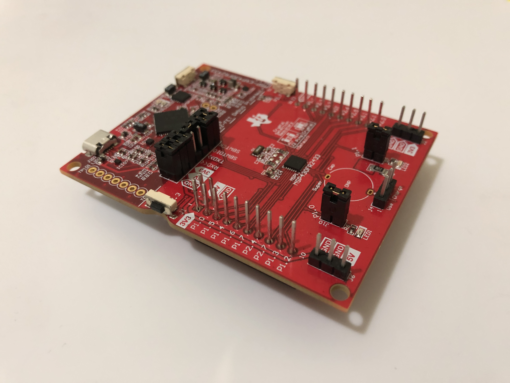

<h1> :skull: VETCON BADGE :skull:  
Hardware Overview </h1>
<h3> For the full manuals, please view the following: </h3>
<h4>
<h4>
    <a href="./README_Engineering.md">Engineering Guide</a>
   · 
    <a href="./README_SOFTWARE.md">Software Guide</a>
</h4>

# :notebook_with_decorative_cover: Table of Contents
- [:notebook_with_decorative_cover: Table of Contents](#notebook_with_decorative_cover-table-of-contents)
  - [:star: About this Guide](#star-about-this-guide)
  - [:computer: Hardware Components](#computer-hardware-components)
    - [:one: Images](#one-images)
      - [:gear: PCB](#gear-pcb)
      - [:gear: Hardware Schematic](#gear-hardware-schematic)
      - [:gear: PCB Schematic](#gear-pcb-schematic)
    - [:two: Bill of Materials](#two-bill-of-materials)
      - [:gear: Purchasing Our Custom PCB](#gear-purchasing-our-custom-pcb)
      - [:gear: Options for Printing Our Custom Case](#gear-options-for-printing-our-custom-case)
    - [:three: Build Instructions](#three-build-instructions)
      - [:gear: Required Tools](#gear-required-tools)
      - [:gear: PCB Soldering Cheat Sheet](#gear-pcb-soldering-cheat-sheet)
      - [:gear: Soldering the HC-05](#gear-soldering-the-hc-05)
      - [:gear: Soldering the 16x2 Screen](#gear-soldering-the-16x2-screen)
      - [:gear: Soldering Pin Risers onto the PCB](#gear-soldering-pin-risers-onto-the-pcb)
      - [:gear: Soldering the Battery and the Power Switch](#gear-soldering-the-battery-and-the-power-switch)
      - [:gear: Soldering the LEDs](#gear-soldering-the-leds)
      - [:gear: Soldering the Final Buttons and Switches](#gear-soldering-the-final-buttons-and-switches)
      - [:gear: Connecting to a Flashed MSP](#gear-connecting-to-a-flashed-msp)
    - [:four: MSP-EXP430FR2433](#four-msp-exp430fr2433)
      - [:gear: Image](#gear-image)
      - [:gear: Purpose](#gear-purpose)
    - [:five: Custom PCB](#five-custom-pcb)
      - [:gear: Image](#gear-image-1)
      - [:gear: Purpose](#gear-purpose-1)
    - [:six: HC-05](#six-hc-05)
      - [:gear: Image](#gear-image-2)
      - [:gear: Purpose](#gear-purpose-2)
    - [:seven: 16x2 Alphanumeric Screen](#seven-16x2-alphanumeric-screen)
      - [:gear: Image](#gear-image-3)
      - [:gear: Purpose](#gear-purpose-3)
    - [:eight: Battey](#eight-battery)
      - [:gear: Image](#gear-image-4)
      - [:gear: Purpose](#gear-purpose-4)
    - [:nine: Smaller Components](#nine-smaller-components)
  - [:memo: Some Notes](#memo-some-notes)

## :star: About this Guide
<h5> THIS GUIDE IS INTENDED TO BE A DETAILED OVERVIEW OF OUR PROJECT'S HARDWARE IMPLEMENTATION </h5>

## :computer: Hardware Components

### :one: Images 

#### :gear: PCB

#### :gear: Hardware Schematic

#### :gear: PCB Schematic

### :two: Bill of Materials

Note, most parts are "swappable" as they are generic electronic components and can be found in *bulk* for dirt cheap.

| Part | Quantity | Total Cost | Link |
|------|:--------:|------------|------|
|Two Pin Rocker Switch|1|$0.09|[Aliexpress](https://www.aliexpress.com/item/4001165826718.html?spm=a2g0o.productlist.0.0.20404e230NX6hE&algo_pvid=84bc44f1-3eb2-47e0-b720-2fbe9e97a58d&algo_exp_id=84bc44f1-3eb2-47e0-b720-2fbe9e97a58d-1&pdp_ext_f=%7B%22sku_id%22%3A%2210000014982124402%22%7D&pdp_npi=1%40dis%7CUSD%7C%7C0.9%7C%7C%7C%7C%7C%400bb0622916511874995468682e4884%7C10000014982124402%7Csea)
|18650 3000mAh Lithium Battery|2|$6.99|[18650 Battery Store](https://www.18650batterystore.com/collections/18650-batteries/products/epoch-30p-18650)
|18650 Battery Holster|1|$0.33|[Aliexpress](https://www.aliexpress.com/item/1005001769305908.html?spm=a2g0o.productlist.0.0.7dac4683MmxuJz&algo_pvid=1fda93ee-0914-4c4f-8085-3958df0f5b50&algo_exp_id=1fda93ee-0914-4c4f-8085-3958df0f5b50-3&pdp_ext_f=%7B%22sku_id%22%3A%2212000024755845325%22%7D&pdp_npi=1%40dis%7CUSD%7C%7C0.33%7C%7C%7C2.29%7C%7C%400b0a557216511875931853563eb368%7C12000024755845325%7Csea)
|TI MSP- EXP430FR2433|1|$11.99|[Digikey](https://www.digikey.com/en/products/detail/texas-instruments/MSP-EXP430FR2433/7931876)
|(1602) 16x2 Alphanumeric LCD|1|$1.66|[Aliexpress](https://www.aliexpress.com/item/1005001636532599.html?spm=a2g0o.productlist.0.0.30bc4475fDEvqy&algo_pvid=75775bf0-f18a-47ba-bcc3-4c5514247a3d&algo_exp_id=75775bf0-f18a-47ba-bcc3-4c5514247a3d-7&pdp_ext_f=%7B%22sku_id%22%3A%2212000016918492352%22%7D&pdp_npi=1%40dis%7CUSD%7C%7C1.66%7C%7C%7C1.99%7C%7C%40210318b816511877020926359ed9f6%7C12000016918492352%7Csea)
|3 Pin, 2-way microswitches|3|$0.13|[Aliexpress](https://www.aliexpress.com/item/2251832863405136.html?spm=a2g0o.productlist.0.0.41971a38qgtUeF&algo_pvid=0aa54f65-0d3e-44a4-a939-55bd78e950de&algo_exp_id=0aa54f65-0d3e-44a4-a939-55bd78e950de-0&pdp_ext_f=%7B%22sku_id%22%3A%2267362403192%22%7D&pdp_npi=1%40dis%7CUSD%7C%7C0.13%7C%7C%7C%7C%7C%40210318d116511878225945897e84bd%7C67362403192%7Csea)
|4 Pin Push button|1|$0.86|[Aliexpress](https://www.aliexpress.com/item/32858344336.html?spm=a2g0o.productlist.0.0.a9ac17d38CE3nU&algo_pvid=15189abc-0adf-48ec-8010-904a6e547115&algo_exp_id=15189abc-0adf-48ec-8010-904a6e547115-2&pdp_ext_f=%7B%22sku_id%22%3A%2265418016751%22%7D&pdp_npi=1%40dis%7CUSD%7C%7C0.86%7C%7C%7C%7C%7C%40210318b816511878701982424eda04%7C65418016751%7Csea)
|HC-05 BT Module|1|$1.92|[Aliexpress](https://www.aliexpress.com/item/32967247206.html?spm=a2g0o.productlist.0.0.3b284977eNrTyE&algo_pvid=7394bb36-299c-4e4a-9806-8e9876ae186d&algo_exp_id=7394bb36-299c-4e4a-9806-8e9876ae186d-0&pdp_ext_f=%7B%22sku_id%22%3A%2266508907103%22%7D&pdp_npi=1%40dis%7CUSD%7C%7C1.92%7C%7C%7C%7C%7C%402101e9d316511879090066545ef96c%7C66508907103%7Csea)
|18650 Battery Charger [Optional]|1|$1.99|[Aliexpress](https://www.aliexpress.com/item/2255800096325349.html?spm=a2g0o.productlist.0.0.7e876c82SL5rrj&algo_pvid=db876199-2568-46a5-aecd-57abbb05b794&algo_exp_id=db876199-2568-46a5-aecd-57abbb05b794-0&pdp_ext_f=%7B%22sku_id%22%3A%2210000001161829607%22%7D&pdp_npi=1%40dis%7CUSD%7C6.24%7C1.99%7C%7C%7C%7C%7C%400bb0623b16511879547118854ed453%7C10000001161829607%7Csea)
|USB-C to Micro USB Adapter | 1 | 0.99 | [Aliexpress](https://www.aliexpress.com/item/1005001355311385.html?spm=a2g0o.productlist.0.0.f2d16eaa5Oa9to&algo_pvid=5cf849db-a416-4d3e-a438-921ea3da315a&algo_exp_id=5cf849db-a416-4d3e-a438-921ea3da315a-1&pdp_ext_f=%7B%22sku_id%22%3A%2212000015793579873%22%7D&pdp_npi=1%40dis%7CUSD%7C3.38%7C0.99%7C%7C%7C%7C%7C%402101e9d216514410377935489eb2bc%7C12000015793579873%7Csea)
|Total Cost|X|$26.96|Not Including any potential shipping cost|

#### :gear: Purchasing Our Custom PCB

Firstly, to have your PCB ready-to-order, you must ensure that you have .DRL files that indicate where your PCB drill holes are.
You can generate these in KiCad by selecting

Once you have all of your .GBR files generated, along with your .DRL files (all of these should be in the [fab_files](../pcb/fab_files/) folder), you can zip them up and send them off to any PCB manufacturing plant!

We recommend JLCPCB, as it is the cheapest/fastest option (the ECE Department's offerings via reimbursement kind of suck). It is trusted by many hobby electronics engineers worldwide.

From there the process is very straightforward, most of the cost comes from shipping, but you can arrange for roughly 15 PCBs for around 25-30 dollars with expedited shipping.

#### :gear: Options for Printing Our Custom Case
Navigate to the [enclosures](../enclosures/) and use standard 3D printing procedures for the STL files. 
Use the most updated STL file labelled "final case" design.

### :three: Build Instructions

#### :gear: Required Tools
<h5> Soldering: </h5> 

Some soldering experience and tools are required, but this is also a relatively simple soldering job. Thus, this project is recommended even for users wishing to learn or practice their soldering skill.

<h5> 3D printing: </h5> 

Although you are free to download the necessary files and print the case on your own, this is not absolutely necessary as you are able to order a custom order through online shops.
<h5> Other tools: </h5> 

Phillips screwdriver and smaller screws.
    
#### :gear: PCB Soldering Cheat Sheet
This PCB is a prototype board, and is slightly different from the final product, but all soldering points are in the same place.
    
<h5>PCB Top</h5>

<h5>PCB Bottom</h5>
    

#### :gear: Soldering the HC-05
The first step is to trim the legs of the HC-05 module, as the device will be soldered horizontally along the PCB. 
    
Place the solder points on the other side of the HC-05 pins onto the 6 open pins under the 16x2 screen, on the back side of the PCB. 

The final result of this step should look like the image below.

#### :gear: Soldering the 16x2 Screen
The next step is to also trim the legs of the 16x2 Alphanumeric LCD Screen, and to solder it onto the PCB. 
    
The screen goes on the front side of the PCB, and should line up with the outline.

#### :gear: Soldering Pin Risers onto the PCB
Next, you will solder pin risers onto the PCB, enabling you to connect our device to the MSP microcontroller. 

Using your MSP, place up pin risers into the pin sockets like the picture below.

Then, place your PCB onto the MSP so that the pin risers fit into the matching open pins on the PCB, and solder them together.

You may now freely disconnect and reconnect your MSP from your PCB

#### :gear: Soldering the Battery and the Power Switch
WARNING: MAKE SURE THE SWITCH IS SET TO OFF, AND THE BATTERY IS NOT IN THE ENCLOSURE BEFORE STARTING THIS STEP!
    
The next step is to connect the Battery Enclosure and the Power Switch to the PCB. Both of these already include wires, of which the positive leads are soldered together, and their negative leads will be soldered directly into the board as shown. 

  
#### :gear: Soldering the LEDs
Now, we will solder all the smaller components on the top-left of the front of the LCD, which include our 3 LEDs, 3 matching resistors, and the potentiometer. 
    
You can do these in any order you wish, but make sure your LED positive lead is soldered to the right mounting spot, and the negative lead on the one on the left.

#### :gear: Soldering the final buttons and switches
Finally, the smallest components must be soldered onto the PCB. We recommend trimming two diagonal leads on the small push button, as only two of them are required. One lead of the button should go to the corresponding lead on the PCB, and another should be connected to pin 2.7 on the MSP.
    
For the smaller 3-pin switches, be careful to solder wire onto only one of the outer leads, and another wire onto the center lead.
    
Carefully follow the [soldering cheat sheet](#gear-pcb-soldering-cheat-sheet) and compare with the following picture of the final product.

#### :gear: Connecting to a Flashed MSP
Now that all of your components have been successfully soldered onto the PCB, you can reconnect the already flashed MSP to the PCB if your disconnected it earlier, plug in the battery and run an out of enclosure test! 
The LCD should turn on and welcome you if every component is working correctly.

    
### :four: MSP-EXP430FR2433

#### :gear: Image

#### :gear: Purpose
[Datasheet](https://www.ti.com/document-viewer/MSP430FR2433/datasheet/device-overview-slas9424409#SLAS9424409)

The MSP microcontroller is the component that runs all of our custom software, and manages all components on the device. The entire hardware design and software library are designed around this microcontroller.

### :five: Custom PCB

#### :gear: Image

#### :gear: Purpose
Our custom PCB is what allows the building process to be relatively simple, as it simplifies soldering each component to the MSP microcontroller. All components should be soldered to the PCB, which then is simply inserted into the socket risers on the MSP.

### :six: HC-05

#### :gear: Image

#### :gear: Purpose
[Datasheet](https://www.etechnophiles.com/wp-content/uploads/2020/10/HC-05-Datasheet-Download.pdf)

The HC-05 is the component that allows our device to wirelessly connect to similar devices using Bluetooth, and is small enough to fit between the custom PCB and the MSP microcontroller.

### :seven: 16x2 Alphanumeric Screen

#### :gear: Image

#### :gear: Purpose

[Datasheet](https://www.engineersgarage.com/sites/default/files/LCD%2016x2.pdf)

The alphanumeric screen is an important part of our device, as it allows each user to customise their badge and view their custom name on their device.

### :eight: Battery

#### :gear: Image

#### :gear: Purpose
[Datasheet](https://cdn.shopify.com/s/files/1/0481/9678/0183/files/EpochBatteries_18650-30P_specification.pdf?v=1634052514)
    
The selected 18650 battery has more than enough capacity to last the required ~21 hours, and has been tested to last around 25 hours, depending on use. 

The battery is also rechargable with the purchase of a battery charger, and allows for one battery to serve as the lone power source for mutiple days with full charges in between uses. The single, 18650 battery supplies 3.6V to the badge with a capacity of 3000mAh.

The badge's power consumption ranges from anywhere between 95mA to 165mA. The large range on these calculations stem from the backlight on the LCD. 
This list includes consumption of each device on the badge: 
- MSP430: 10mA
- HC-05: 10mA 
- LEDs(x3): 45mA
- LCD(backlight off): 30mA 
- LCD(backlight on): 100mA.
    
### :nine: Smaller Components

1. Battery Holster
2. Power Switch
3. 3-pin Switches (3)
4. LEDs (3)
5. Small Push Button
6. Potentiometer
7. Resistors [NOT PICTURED]

## :memo: Some Notes
If you'd like to continue this project, you might want to [fork](https://docs.github.com/en/get-started/quickstart/fork-a-repo) OR [duplicate](https://docs.github.com/en/repositories/creating-and-managing-repositories/duplicating-a-repository) this repository rather than attempting to push your own commits/do a pull request. This way, you get to have as much creative freedom with the code as you desire (obviously respecting the GNU GPL v3 license).

We intend to keep this repo as-is in a "finished" state. 

If you do have any questions, or make any cool developments/improvements that you would like to let us know about! Feel free to shoot us an email with the header: [GH EC463] + your name - {subject}

Happy hunting :)
